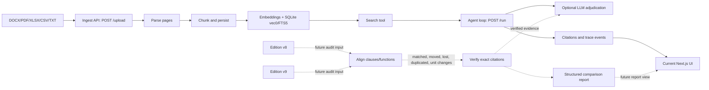

# Function Lineage Auditor: architecture

The repository currently implements the document-ingestion and grounded-agent
vertical slice. The two-edition auditor is the product direction: comparison,
clause-level verification, and a structured report must be added on top of the
existing interfaces before they can be presented as implemented features.

| Component | Responsibility | Current repository boundary |
| --- | --- | --- |
| Ingest | Accept files and store upload bytes | `POST /upload`, `ingest/pipeline.py` |
| Parse | Extract page/block text and media type | `ingest/parsers.py` |
| Align | Compare two editions by clause/function | Planned audit layer; not exposed by the current API |
| Verify citations | Keep each finding tied to source text and page/clause | Current search results carry source/page; exact two-edition verification is planned |
| LLM adjudication | Optional interpretation after deterministic evidence retrieval | `agent/llm.py` and `agent/loop.py`; no key is required for `/healthz` |
| Report | Return findings, evidence, unresolved cases, and conclusion | Planned audit report; current API exposes upload metadata, SSE events, and traces |
| UI | Upload documents, ask grounded questions, inspect run trace | `apps/web/src/app/page.tsx` and timeline components |

The cross-slice contract is the binding interface: SQLite is the persistence
layer, `POST /upload` indexes documents, `POST /run` emits the SSE event
envelope, and `GET /runs/{run_id}/trace` replays the stored trace. The
keyless degraded path remains mandatory: missing `LLM_API_KEY` must not make
the process crash, and the API must report that the LLM is not configured.