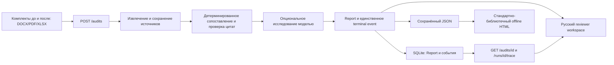

# Function Lineage Auditor: architecture

## Public audit path

Backend owns domain decisions and evidence validation. The browser and exporter do not invent unit transitions, risk classifications, findings, model actions or a second Report format. The Stage 3 schema handoff is `4da4390`; the wire source is `apps/api/app/audit/models.py`, with the HTTP/SSE amendment in `CONTRACT.md`.

## Consumer boundaries

| Boundary | Implementation and invariant |
| --- | --- |
| Upload | `AuditWorkspace.tsx` / `UploadDropzone.tsx`: repeated `before_files` and `after_files`, `use_llm`; DOCX/PDF/XLSX plus TXT reading aid. DOC/XLS require conversion, not renaming. |
| Wire gate | `lib/api.ts`: validates nested Report types and unique source/result IDs before rendering; preserves absent fields and `agent: null` for old reports. |
| Reviewer | `AuditReport.tsx`: 25-row pages, search/status/review filters, N:M unit transitions, function findings, separately typed cross-unit risks, conclusion links to each output type. No summed duplication metric for overlapping finding/risk evidence. |
| Sources | `lib/audit.ts`: document-scoped indexes, exact substring checks, defining role/unit citations, parent/neighbor context. Only supplied PDF page, DOCX block or sheet/cell coordinates are shown; unknown locations are not invented. |
| Agent visibility | `Report.mode` and `Report.agent` are distinct. Completed/partial/unavailable/failed/not_requested, stop reason and investigated subset are shown as supplied. Completed is not full-document review. Missing/null agent and historical empty additions mean not assessed. |
| Actions | Existing SSE and persisted trace only: real tool name, arguments, result and public reason. Token/internal SDK span content is not displayed as reasoning. Host status messages do not prove model participation. Reopening is explicitly replay, not a new run. |
| Bounded UI operations | Five-minute audit connection deadline, thirty-second report/trace opening deadline, cancellation and stale-response guards. A terminal event ends waiting; truncated/empty streams surface errors. Cancellation does not claim server-side cancellation. |
| Persistence | Report and trace come from separate public endpoints. Report JSON download/local import retains all public fields; local files (up to 50 MiB) are not uploaded. A missing trace stays visibly missing rather than synthesized from counters. |
| Offline export | `scripts/export_report.py`: JSON only, no SQLite, no model calls or external assets. Escaped text, CSP, hash-based fragment IDs, exact-source checks, visible edition/role mismatch warnings and duplicate-ID rejection. All findings, units, changes, risks, conclusion links, locations, warnings and agent metadata remain inspectable. |

## Implemented versus integrated

The published backend now includes the Stage 3 producer and bounded investigation loop (`f104c91`), followed by source-risk/finalization corrections (`b392d9b`). Do not describe the current code as schema-only. The old `8b896c1` local run remains evidence of its own earlier empty outputs/null-agent behavior, not the new backend.

Isolated integration exercised that producer with real inputs. Control DOCX returned 19 findings, seven unit changes and two risks; all 72 clauses carry block coordinates. Full saved Reports survived API restart and retained all fields in browser JSON and standalone HTML. Published Askat code pin `996512db146a045966f30335e40bed89b2a0d1a0` has identical application/script trees to the built and browser-verified pre-rebase `085975f`; the only additional application change makes source limitations readable without changing their originals or the Report. PDF page and XLSX sheet/cell coordinates exist, but PDF fragmentation and XLSX extraction remain backend handoffs.

The immutable supplied `f104c91` capture contains seven unit changes and a genuine partial agent investigation: 25 observational tool calls, a turn-limit stop and deterministic final mode. Its analytical payload is unchanged from the paired baseline. That is historical supplied execution evidence, not a new live run by Askat or proof of completed agent review at `b392d9b`. Current integration checks and backend reproductions are recorded separately in [launch evidence](evidence/kt-launch.md).

The subsequently received `b392d9b` OpenAI capture supersedes a missing-current-capture claim: completed run `9c7199f33a9f4ca3a9a47abfd65b8c6f` has 7 turns/22 calls, while separately preserved budget-limited `1c3f51541f754b20925f1d50ec47ec07` remains partial at 8/26. Both retain 19 findings, seven unit changes and two risks. Independent review `7c5b273` confirms source-dependent saved execution, not full semantic acceptance or an expert-access route. Askat consumes these artifacts without invoking the provider.

Visual delivery `93f5479` preserves the Report and navigation contract: Russian diagnostic captions retain verbatim originals in disclosures, coverage bars describe extracted-clause accounting rather than accuracy, filenames wrap without overlapping controls, and the desktop action panel remains visible during sidebar scrolling.

## Security and ownership

Batyrkhan owns backend, contracts, root runtime and dependency manifests/locks; Alibi owns evaluation/control/gold; Askat owns frontend/export/delivery. Local verification binds both servers to loopback. No unauthenticated public deployment, document transfer to a new provider or paid inference is authorised by this architecture. An approved judge-accessible agent route remains a separate release gate.
